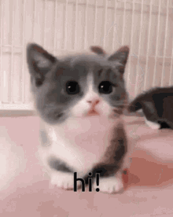

# Be My Valentine 💝

A cute and interactive Valentine's proposal website featuring adorable cat animations, playful interactions, and charming effects!



## Features

- 🐱 Adorable cat animations and reactions
- 💖 Interactive proposal experience
- ✨ Beautiful confetti animations
- 🎯 Playful "No" button that tries to escape
- 🎨 Smooth transitions and effects

## Prerequisites

Before you begin, ensure you have the following installed:
- [Node.js](https://nodejs.org/) (version 16 or higher)
- npm (comes with Node.js)

## Getting Started

1. Clone the repository:
```bash
git clone git@github.com:prakash-aryan/be-my-valentine.git
```

2. Navigate to the project directory:
```bash
cd be-my-valentine
```

3. Install dependencies:
```bash
npm install
```

4. Start the development server:
```bash
npm run dev
```

5. Open your browser and visit:
```
http://localhost:5173
```

## Technology Stack

- React
- Vite
- TailwindCSS
- Lucide Icons

Feel free to use this code to create your own Valentine's proposal!
---

Made with 💖 and lots of meow-gic!